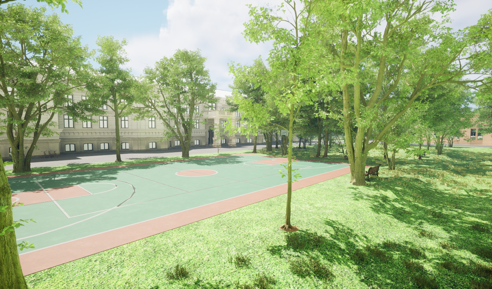
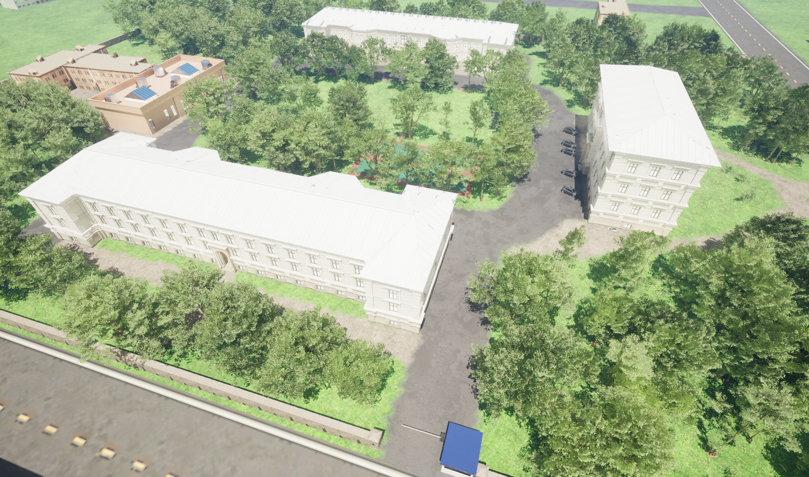
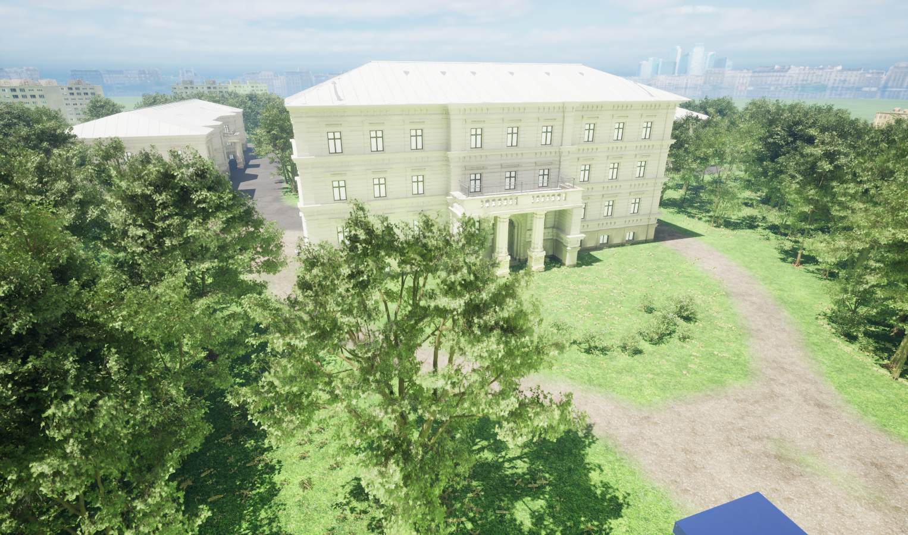
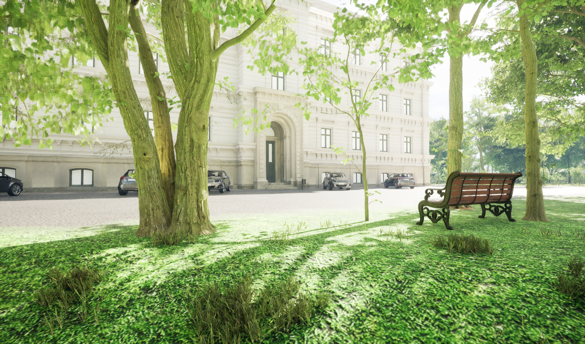
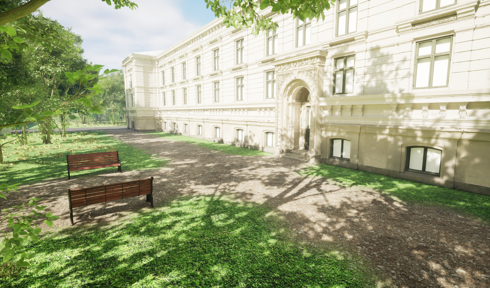
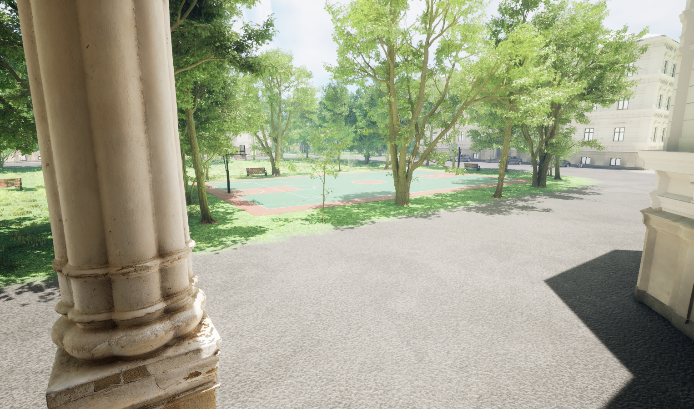

# Educational simulation of the university campus in a 3D environment using Unreal Engine 5
It's a 3D educational simulation, where the user can visit the campus of Óbuda University in Székesfehérvár. The Simulation was created using the Unreal Engine 5 3D graphics engine. It uses high resolution textures to make the environment and buildings look more realistic. The simulation can be run on any 64-bit Windows system. It uses only free textures and 3D objects.

## Screenshots

## Used Sotwares
- Unreal Engine 5
- Quixel Bridge
- Twinmotion

## Documentation
Link will be published after the thesis is defended.

## Demo
Link will be published after the thesis is defended.

## Author
- [@istvanszasz99](https://www.github.com/istvanszasz99)
